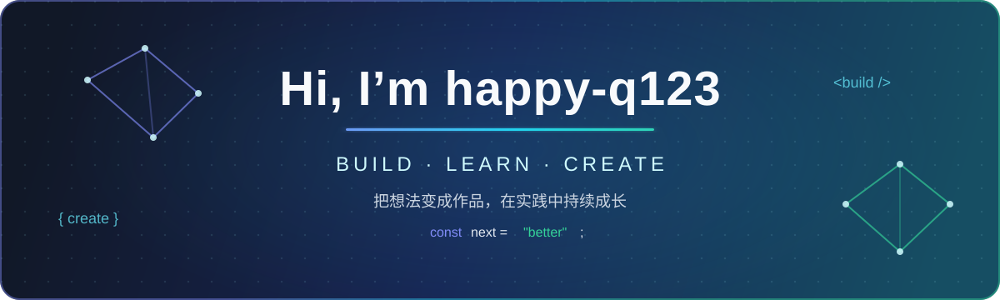

## 🧰 个人技术栈

### AI Agent与计算机视觉

  
  
  
  
  

车道线检测、深度学习模型训练与推理、CUDA 算子、Multi-Agent、RAG、向量检索、会话记忆与答案质量评估。

### Java 后端与分布式系统

  
  
  
  
  

Spring Security、OAuth2、JWT、RBAC、MyBatis-Plus、Nacos、OpenFeign、RocketMQ、Redisson、PGVector、WebSocket、STOMP。

### 前端与浏览器扩展

  
  
  
  
  

Vue Router、Element Plus、Axios、ECharts、STOMP.js、WebRTC、Chrome Extension Manifest V3。

### 基础与工程工具

  
  
  
  
  

## 🚀 项目经历

<table>
  <tr>
    <td width="50%" valign="top">
      <h3 align="center"><a href="https://github.com/happy-q123/ExamPlatform">🎓 ExamFlow 智能考试平台</a></h3>
      
<b>智能体驱动的全栈在线考试平台</b>

      
<b>技术栈</b>

      
<code>Java 17</code> <code>Spring Boot</code> <code>Spring Cloud</code> <code>Spring AI</code> <code>Vue 3</code> <code>TypeScript</code> <code>PGVector</code> <code>Redis</code>

      
<b>项目简介</b>

      <ul>
        <li>覆盖出题、考试、监考、阅卷、错题沉淀与个性化讲解。</li>
        <li>构建 Multi-Agent + RAG 错题助手，包含检索、重排、生成、评估与失败重试。</li>
        <li>使用 OAuth2、JWT、RBAC、STOMP 和 WebRTC 支撑认证、权限与实时监考。</li>
      </ul>
    </td>
    <td width="50%" valign="top">
      <h3 align="center"><a href="https://github.com/happy-q123/SDLane">🛣️ SDLane</a></h3>
      
<b>高效车道线检测框架</b>

      
<b>技术栈</b>

      
<code>Python</code> <code>PyTorch</code> <code>OpenCV</code> <code>CUDA/C++</code> <code>NumPy</code> <code>CULane</code>

      
<b>项目简介</b>

      <ul>
        <li>基于稀疏线锚与动态核融合，兼顾检测速度与精度。</li>
        <li>CULane 上以 5 个线锚达到 79.78 F1，并实现 486 FPS、2.06 ms 延迟。</li>
        <li>实现 CUDA NMS 加速与 Python 降级路径，覆盖训练、验证、测试和可视化。</li>
      </ul>
    </td>
  </tr>
  <tr>
    <td width="50%" valign="top">
      <h3 align="center"><a href="https://github.com/happy-q123/auto-ws">🧾 网申助手</a></h3>
      
<b>自动填写企业招聘网申表单</b>

      
<b>技术栈</b>

      
<code>JavaScript ES6+</code> <code>Manifest V3</code> <code>Chrome Storage</code> <code>MutationObserver</code> <code>HTML/CSS</code>

      
<b>项目简介</b>

      <ul>
        <li>通过关键词、同义词和模糊匹配自动识别并填写表单字段。</li>
        <li>支持级联选择器、非原生组件、iframe、日期转换和多套简历模板。</li>
        <li>数据仅保存在浏览器本地，支持自定义规则和 JSON 导入导出。</li>
      </ul>
    </td>
    <td width="50%" valign="top">
      <h3 align="center"><a href="https://github.com/happy-q123/cloud-venue-sbuscribe">🏟️ 场馆预定平台</a></h3>
      
<b>面向高并发预定场景的 SaaS 系统</b>

      
<b>技术栈</b>

      
<code>JDK 17</code> <code>Spring Boot 3</code> <code>Spring Cloud</code> <code>Redis</code> <code>RocketMQ</code> <code>ShardingSphere</code> <code>Canal</code>

      
<b>项目简介</b>

      <ul>
        <li>按用户、场馆、订单、支付与网关拆分微服务。</li>
        <li>使用 Redis BitMap、Lua、限流和异步处理优化高并发预定。</li>
        <li>实践分库分表、缓存一致性、延时关单、支付和附近场馆查询。</li>
      </ul>
    </td>
  </tr>
  <tr>
    <td width="50%" valign="top">
      <h3 align="center"><a href="https://github.com/happy-q123/MailMindAgent">📬 MailMind Agent</a></h3>
      
<b>面向多邮箱的本地优先智能邮件工作台</b>

      
<b>技术栈</b>

      
<code>Python 3.12</code> <code>FastAPI</code> <code>LangGraph</code> <code>LangChain</code> <code>ChromaDB</code> <code>SQLite</code> <code>React 19</code> <code>TypeScript</code>

      
<b>项目简介</b>

      <ul>
        <li>通过 IMAP/SMTP 统一接入多个邮箱，支持 UID 增量同步、失败退避与账户隔离。</li>
        <li>使用 LangGraph 编排邮件研判流程，结合混合 RAG、线程上下文、长期记忆与 Copilot。</li>
        <li>采用 local-first 设计，回复草稿须经人工审批才可外发，兼顾效率、可解释性与数据边界。</li>
      </ul>
    </td>
    <td width="50%" valign="top">
      <h3 align="center"><a href="https://github.com/happy-q123/chao-shi-admin">🛒 超市商品管理系统</a></h3>
      
<b>C/C++ 基础工程实践</b>

      
<b>技术栈</b>

      
<code>C</code> <code>C++</code> <code>文件读写</code> <code>控制台程序</code>

      
<b>项目简介</b>

      <ul>
        <li>围绕超市商品信息实现录入、查询、修改和维护流程。</li>
        <li>使用 C 语言完成主体功能，并在部分模块中使用 C++。</li>
        <li>通过文件读写保存数据，实践结构体、函数拆分和菜单交互。</li>
      </ul>
    </td>
  </tr>
</table>
